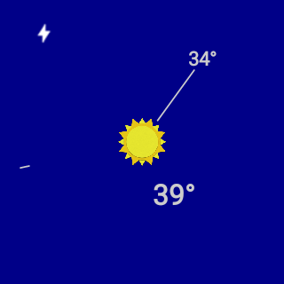

Synchronizes weather information from OpenWeatherMap on Android Phones and Tablets. Used in the Udacity Advanced Android course.

Just past 5:00 somewhere...

 * Daily high temp is hour hand
 * Daily low temp is minute hand
 * Seconds are shown as a tiny mark that travels around the perimeter of the clock
 * Center icon represents the daily weather
